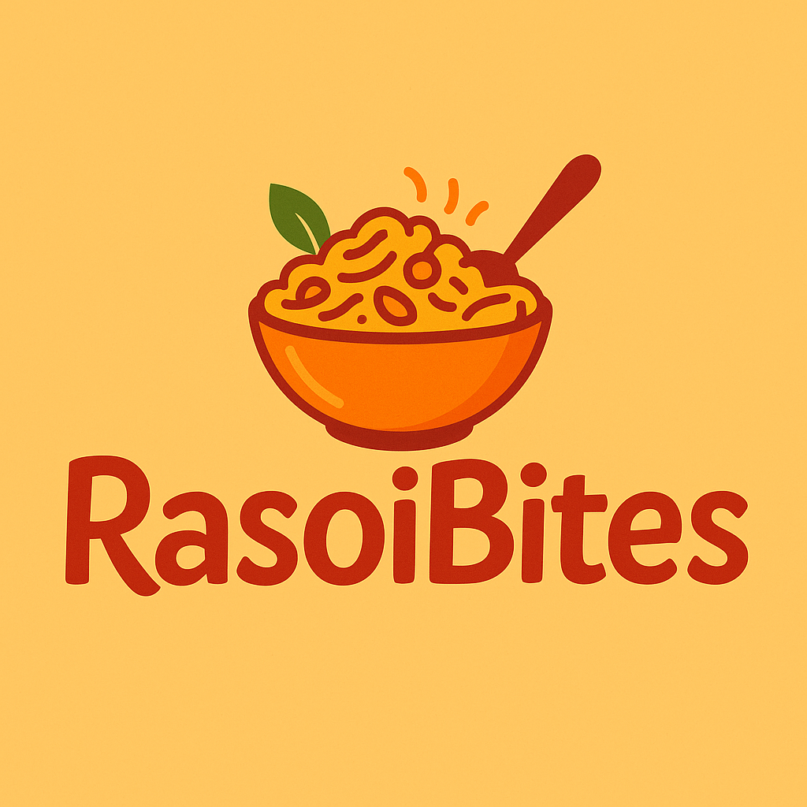

# RasoiBites 🍲🇮🇳  
**Premium Indian Namkeen & Healthy Snacks Showcasing Website**

Welcome to **RasoiBites**, a beautifully designed website built using **Next.js + TypeScript** that showcases India’s finest premium namkeen and healthy snacks. The goal of this website is to present the rich variety of traditional Indian munchies RasoiBites offers and help dealers or interested buyers connect with us directly.

 <!-- Replace with your actual image path -->

---

## 🌟 Features

- 🛍️ **Showcase of All Products** – An elegant display of RasoiBites' entire namkeen and snack lineup.
- 📖 **About the Brand** – Learn more about the RasoiBites story and values.
- 📝 **Customer Reviews** – Display of testimonials and reviews from happy customers.
- 🤝 **Dealer Inquiry Form** – A contact form for potential dealers to send inquiries. Submissions are emailed directly.
- 🎨 **Custom Fonts & SEO Metadata** – Optimized with multiple web fonts and SEO metadata for improved performance and search visibility.
- 📱 **Responsive Design** – Seamless experience across devices.

---

## 🛠️ Tech Stack

- **Framework:** [Next.js](https://nextjs.org/) (App Router)
- **Language:** TypeScript
- **Styling:** Tailwind CSS
- **Fonts:**  
  - Akaya Telivigala  
  - Concert One  
  - Poppins  
  - Quicksand  
  - Geist Sans & Mono  
- **Hosting:** Deployed on [Vercel](https://vercel.com/)

---

## 🔧 Project Structure

The project follows a clean structure with SEO best practices:

- `app/` – Page routes and layout components
- `public/` – Static files (images, icons, etc.)
- `components/` – Reusable UI components
- `utils/` – Utility functions
- `styles/` – Global CSS and font configurations
- `metadata.ts` – Metadata configuration including Open Graph, Twitter Card, robots, JSON-LD, etc.

---

## ✉️ Dealer Form & Inquiry

A dedicated form is provided on the site for **dealers or business inquiries**. When submitted, the form data is sent directly via email using a mail service (configured securely on the server).

---

## 🔍 SEO & Metadata Highlights

This project includes extensive SEO optimizations:
- Meta tags (title, description, keywords)
- OpenGraph and Twitter metadata
- JSON-LD structured data for rich search results
- Language and canonical support (`en-IN`, `hi-IN`)
- Google, Bing, and Yahoo verification options

---

## 🚀 Getting Started (Development)

```bash
# Clone the repo
git clone https://github.com/your-username/rasoibites.git
cd rasoibites

# Install dependencies
npm install

# Run the development server
npm run dev
```
---

🌐 Live Website
👉 https://rasoibites.vercel.app
---

🧑‍💻 Author
Built with ❤️ by the Aditya Kumar

---

📄 License
This project is licensed under the MIT License.
---